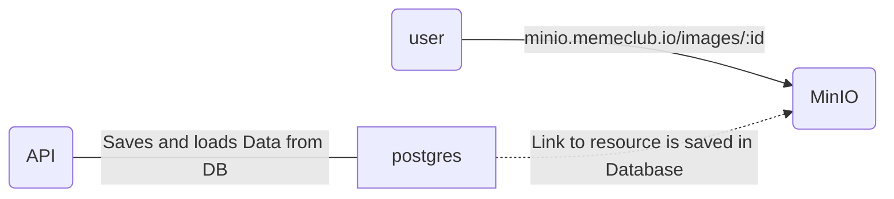
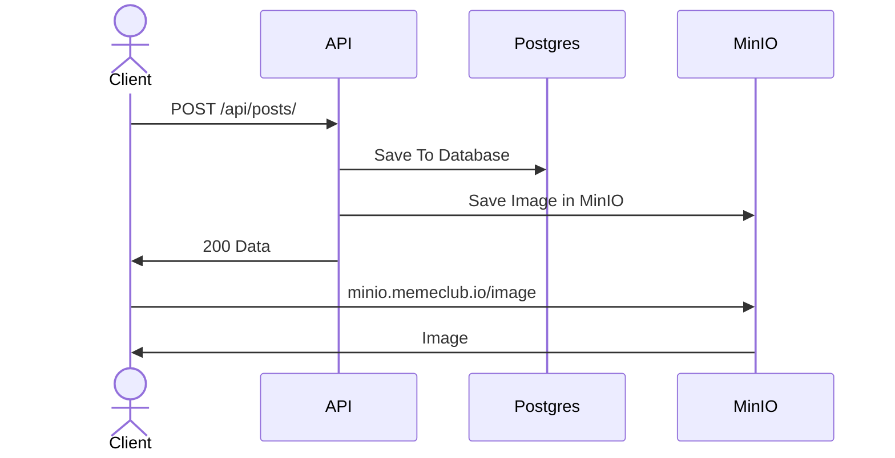

# Architectural Overview of memeclub

```mermaid
graph LR
    user(user)-- minio.memeclub.io/images/:id --> minio(MinIO)
    api(API)-- Saves and loads Data from DB ---postgres
    postgres-. Link to resource is saved in Database .-> minio(MinIO)
```

## How a post is processed

```mermaid
sequenceDiagram
    actor Client
    Client->>API: POST /api/posts/
    API->>Postgres: Save To Database
    API->>MinIO: Save Image in MinIO
    API->>Client: 200 Data
    Client->>MinIO: minio.memeclub.io/image
    MinIO->>Client: Image
```